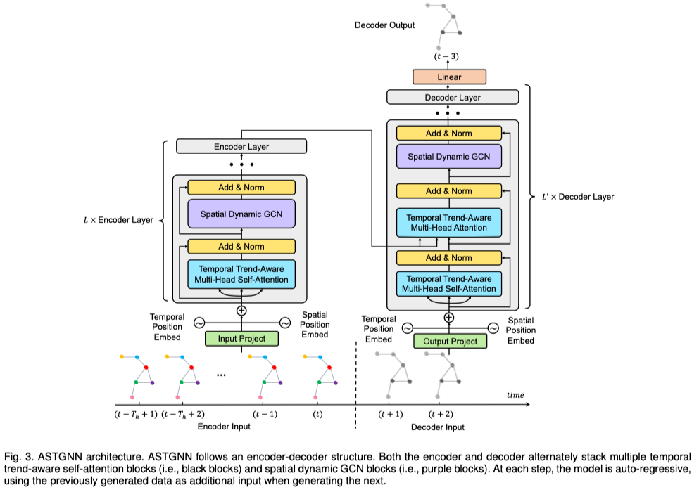

# ASTGNN

This is a Pytorch implementation of ASTGNN. Now the corresponding paper is available online at https://ieeexplore.ieee.org/document/9346058.



# Train and Test

We take the commands on PEMS04 for example.

Step 1: Process dataset:

- on PEMS04 dataset

  ```python
  python prepareData.py --config configurations/PEMS04.conf
  ```

  ```python
  python prepareData.py --config configurations/PEMS04_rdw.conf
  ```

Step 2: train and test the model:

```python
nohup python -u train_ASTGNN.py --config configurations/PEMS03.conf --cuda=1 > pems03.out &
```

The settings for each experiments are given in the "configurations" folder.

If you find the repository is useful, please cite our paper. Thank you.