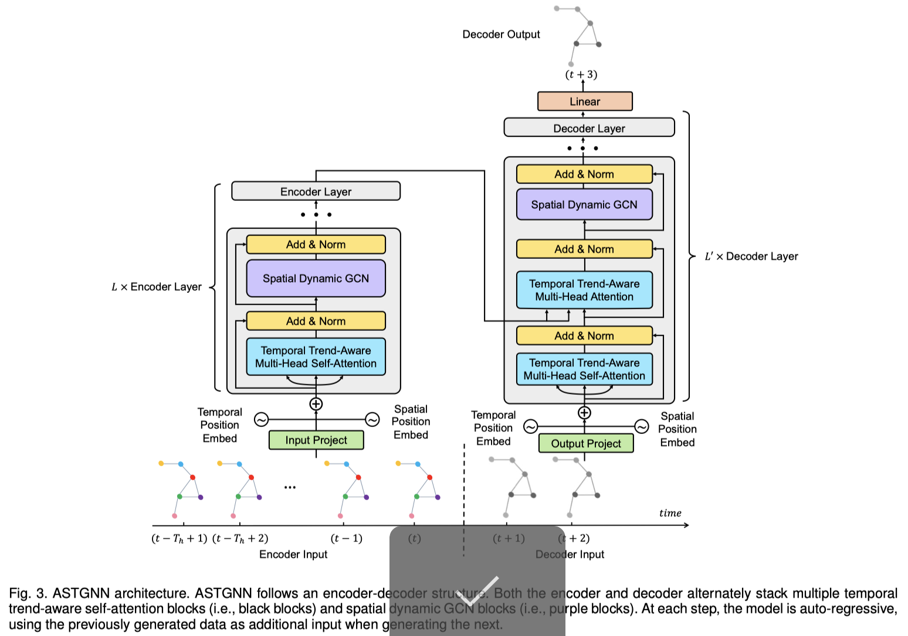

# ASTGNN

This is a Pytorch implementation of ASTGNN. Now the corresponding paper is available online at https://ieeexplore.ieee.org/document/9346058.



# Train and Test

We take the commands on PEMS04 for example.

Step 1: Process dataset:

- for ASTGNN

```python
python prepareData.py --config configurations/PEMS04.conf
```

- for ASTGNN(p)

```python
python prepareData.py --config configurations/PEMS04_rdw.conf
```

Step 2: train and test the model:

- for ASTGNN

```python
nohup python -u train_ASTGNN.py --config configurations/PEMS04.conf --cuda=1 > pems04.out &
```

- for ASTGNN(p)

```python
nohup python -u train_ASTGNN.py --config configurations/PEMS04_rdw.conf --cuda=1 > pems04_rdw.out &
```

The settings for each experiments are given in the "configurations" folder.

If you find the repository is useful, please cite our paper. Thank you~